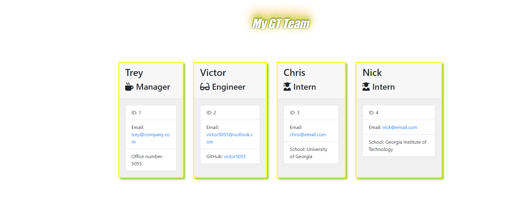
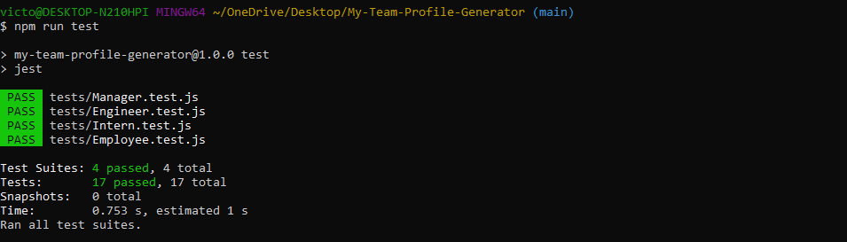
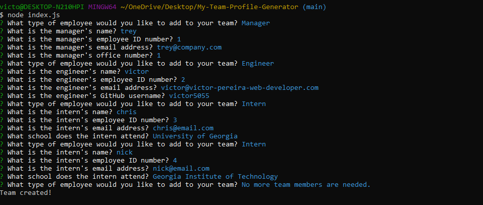

# My-Team-Profile-Generator

[Video Demo] (https://drive.google.com/file/d/1QQms41Iz0e1zEz5FqA5F1PJRbw4VEfUq/view)
[licenseBadge] 

## Table of Contents
*[Description of Repository](#Repository-Description)
*[User-Story](#User-Story)
*[Contribution-Guidelines](#Contribution-Guidelines)
*[Repositiory-End-Goal-Criterea](#Repositiory-End-Goal-Criterea)
*[License](#License)
*[Contact](#Contact)

## Repository-Description
###### [Back to Table of Contents](#Table-of-Contents)
A software engineering team-generator command line application. The application will prompt the user for information about the team manager and then information about the team members. The user can input any number of team members, and they may be a mix of engineers and interns. Then an HTML page is created that can be easily viewed in a web browser.

## User-Story
### As the Developer
###### [Back to Table of Contents](#Table-of-Contents)
GIVEN a command-line application that accepts user input
WHEN I am prompted for my team members and their information
THEN an HTML file is generated that displays a nicely formatted team roster based on user input
WHEN I click on an email address in the HTML
THEN my default email program opens and populates the TO field of the email with the address
WHEN I click on the GitHub username
THEN that GitHub profile opens in a new tab
WHEN I start the application
THEN I am prompted to enter the team manager’s name, employee ID, email address, and office number
WHEN I enter the team manager’s name, employee ID, email address, and office number
THEN I am presented with a menu with the option to add an engineer or an intern or to finish building my team
WHEN I select the engineer option
THEN I am prompted to enter the engineer’s name, ID, email, and GitHub username, and I am taken back to the menu
WHEN I select the intern option
THEN I am prompted to enter the intern’s name, ID, email, and school, and I am taken back to the menu
WHEN I decide to finish building my team
THEN I exit the application, and the HTML is generated.

## Contribution-Guidelines
###### [Back to Table of Contents](#Table-of-Contents)
none

## Installation
###### [Back to Table of Contents](#Table-of-Contents)
Run 'npm install' to install dependencies

Run 'node index.js' to run program

Open the 'team.html' file from the output folder in a web browser to view

To clone the repo:
  
git clone git@github.com:victor5055/My-Team-Profile-Generator.git

## Overview: What Was Accomplished!
### Workflow [Back to Table of Contents](#Table-of-Contents)
Created an Awesome webpage that displays my team's basic info so that I have access to emails and GitHub profiles.

## Tests 
###### [Back to Table of Contents](#Table-of-Contents)

It is recommended that you follow this workflow:

Run tests

Create or update classes to pass a single test case

Repeat

Remember, you can run the tests at any time with:

"npm run test"

### Screenshots (Building this application)
###### [Back to Table of Contents](#Table-of-Contents)

## Repositiory-End-Goal-Criterea
###### [Back to Table of Contents](#Table-of-Contents)
Stay on Task

## License
MIT
* For more information on license types, please reference this website
for additional licensing information - [https: //choosealicense.com/](https://choosealicense.com/).

## Contact
###### [Back to Table of Contents](#Table-of-Contents)
* Github Username: victor5055
* Github Profile link:(https://github.com/victor5055)
* Email: victor5055@outlook.com

Permission is hereby granted, free of charge, to any person obtaining a copy of this software and associated documentation files (the "Software"), to deal in the Software without restriction, including without limitation the rights to use, copy, modify, merge, publish, distribute, sublicense, and/or sell copies of the Software, and to permit persons to whom the Software is furnished to do so, subject to the following conditions:

The above copyright notice and this permission notice shall be included in all copies or substantial portions of the Software.

THE SOFTWARE IS PROVIDED "AS IS", WITHOUT WARRANTY OF ANY KIND, EXPRESS OR IMPLIED, INCLUDING BUT NOT LIMITED TO THE WARRANTIES OF MERCHANTABILITY, FITNESS FOR A PARTICULAR PURPOSE AND NONINFRINGEMENT. IN NO EVENT SHALL THE AUTHORS OR COPYRIGHT HOLDERS BE LIABLE FOR ANY CLAIM, DAMAGES OR OTHER LIABILITY, WHETHER IN AN ACTION OF CONTRACT, TORT OR OTHERWISE, ARISING FROM, OUT OF OR IN CONNECTION WITH THE SOFTWARE OR THE USE OR OTHER DEALINGS IN THE SOFTWARE.